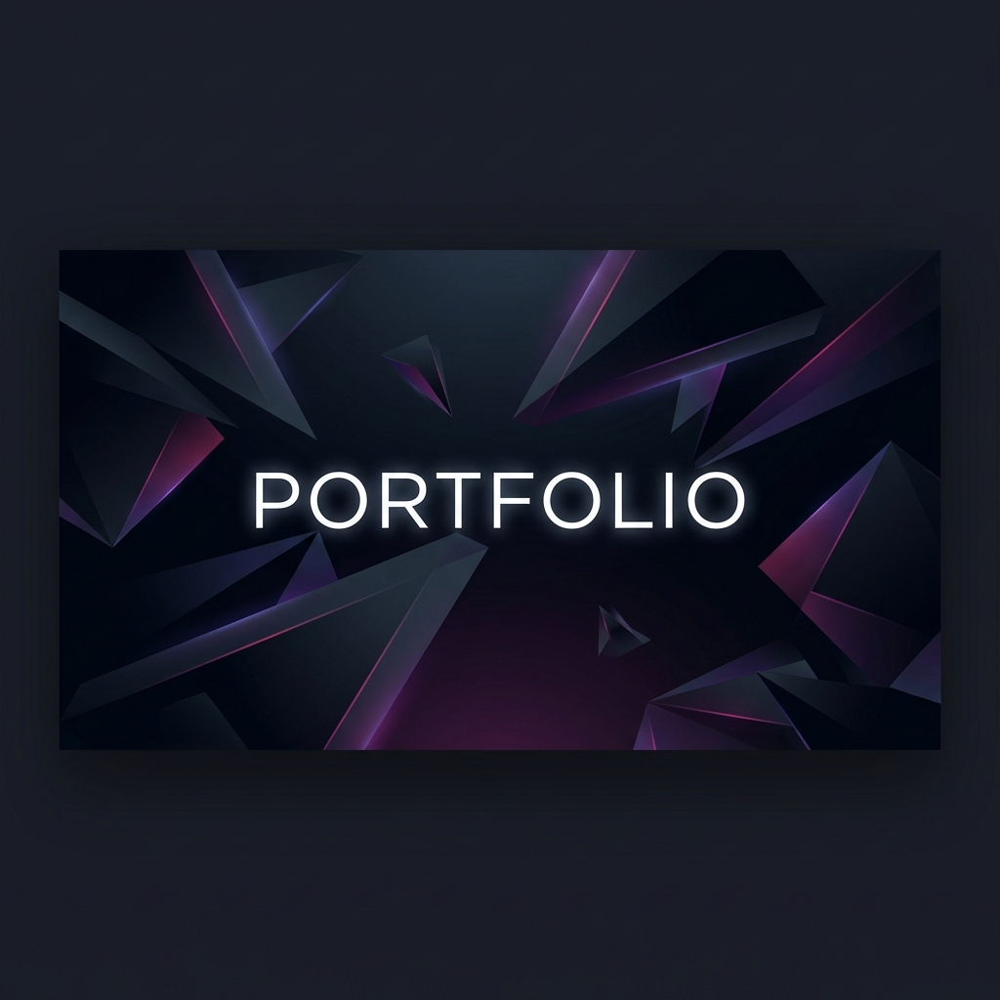

<div align="center">
  
  
  # 🚀 Dev Das | Portfolio

  A sleek, high-performance portfolio website built with **Next.js 15**, **Supabase**, and **Framer Motion**. Designed for elegance and optimized for performance.

  [Live Demo](#) · [Report Bug](https://github.com/user/project/issues) · [Request Feature](https://github.com/user/project/issues)

  ---

  [](https://nextjs.org/)
  [](https://tailwindcss.com/)
  [](https://supabase.com/)
  [](https://www.framer.com/motion/)
  [](https://www.typescriptlang.org/)

</div>

## ✨ Features

- 🎨 **Modern UI/UX**: Clean, responsive design with a focus on typography and animations.
- ⚡ **Framework**: Built with **Next.js 15 (App Router)** for peak performance and SEO.
- 🛡️ **Admin Dashboard**: Full CRUD for projects and blogs via **Supabase**.
- 📮 **Contact Flow**: Integrated contact form powered by **Nodemailer**.
- 🎭 **Smooth Transitions**: Orchestrated animations using **Framer Motion**.
- 🌓 **Theming**: Native support for Dark/Light modes with `next-themes`.

## 🛠️ Installation

1. **Clone the repository**
   ```bash
   git clone https://github.com/devd-328/portfolio.git
   cd portfolio
   ```

2. **Install dependencies**
   ```bash
   npm install
   ```

3. **Set up Environment Variables**
   Create a `.env.local` file and add your Supabase and Email credentials:
   ```env
   NEXT_PUBLIC_SUPABASE_URL=your_supabase_url
   NEXT_PUBLIC_SUPABASE_ANON_KEY=your_supabase_key
   EMAIL_USER=your_gmail
   EMAIL_PASS=your_gmail_app_password
   ```

4. **Run the development server**
   ```bash
   npm run dev
   ```

## 📂 Project Structure

```text
├── src/
│   ├── app/            # Next.js App Router Pages
│   ├── components/     # UI & Shared Components
│   ├── lib/            # Utilities & Database Client
│   └── types/          # TypeScript Definitions
├── public/             # Static Assets
└── supabase/           # Migrations & Config
```

## 🤝 Contact

Feel free to reach out for collaborations or just a tech chat!

[](https://github.com/devd-328)
[](https://www.linkedin.com/in/dev-das-webdev/)
[](https://x.com/devdas_tech)
[](https://www.instagram.com/devdas.tech)
[](mailto:devdas.tech10@gmail.com)

---
<p align="center">Made with ❤️</p>
